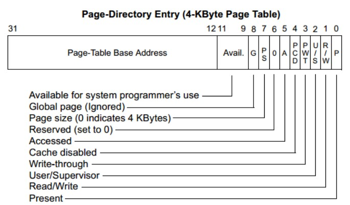
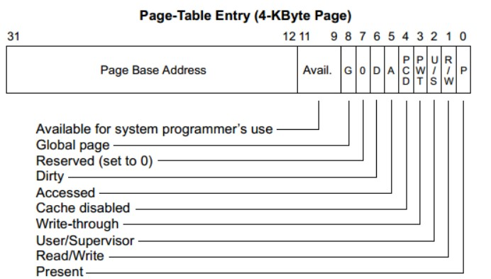

# lab3操作系统实验报告

# Lab3 缺页异常和页面置换

---

安怡然 2213393 翟乐炜2213469 郭笑语 2211392

# 1. 实验目的

- 了解虚拟内存的 Page Fault 异常处理实现
- 了解页替换算法在操作系统中的实现
- 学会如何使用多级页表，处理缺页异常（Page Fault），实现页面置换算法。

# 2. 实验内容

对实验报告的要求：

- 基于markdown格式来完成，以文本方式为主
- 填写各个基本练习中要求完成的报告内容
- 完成实验后，请分析ucore_lab中提供的参考答案，并请在实验报告中说明你的实现与参考答案的区别
- 列出你认为本实验中重要的知识点，以及与对应的OS原理中的知识点，并简要说明你对二者的含义，关系，差异等方面的理解（也可能出现实验中的知识点没有对应的原理知识点）
- 列出你认为OS原理中很重要，但在实验中没有对应上的知识点

### 练习1：理解基于FIFO的页面替换算法（思考题）

> 描述FIFO页面置换算法下，一个页面从被换入到被换出的过程中，会经过代码里哪些函数/宏的处理（或者说，需要调用哪些函数/宏），并用简单的一两句话描述每个函数在过程中做了什么？（为了方便同学们完成练习，所以实际上我们的项目代码和实验指导的还是略有不同，例如我们将FIFO页面置换算法头文件的大部分代码放在了kern/mm/swap_fifo.c文件中，这点请同学们注意）
> 
> - 至少正确指出10个不同的函数分别做了什么？如果少于10个将酌情给分。我们认为只要函数原型不同，就算两个不同的函数。要求指出对执行过程有实际影响,删去后会导致输出结果不同的函数（例如assert）而不是cprintf这样的函数。如果你选择的函数不能完整地体现”从换入到换出“的过程，比如10个函数都是页面换入的时候调用的，或者解释功能的时候只解释了这10个函数在页面换入时的功能，那么也会扣除一定的分数

在整个页面置换的过程中，首先通过 `swap_init` 初始化页面置换管理器，包括设置置换算法和 FIFO 的管理链表。在缺页时，`do_pgfault` 函数触发，它会确认所访问地址的合法性和写权限，然后调用 `find_vma` 查找该地址所在的虚拟内存区域。缺页处理函数 `get_pte` 获取线性地址的页表项，如果没有分配页表则创建页表，并通过 `pgdir_alloc_page` 分配新页面。

接着，`swap_in` 将页面从交换区读取到内存中，并调用 `page_insert` 建立物理地址与虚拟地址的映射关系。在映射建立后，`swap_map_swappable` 将页面标记为可交换，并通过 `_fifo_map_swappable` 添加到 FIFO 队列中，以便在内存不足时进行管理。

当内存不足时，`swap_out` 函数会被调用，它从 FIFO 队列中选择“最早换入”的页面作为受害页面，通过 `swapfs_write` 将页面内容写入磁盘，并调用 `page_remove_pte` 移除页面映射，更新引用计数并释放内存。这样整个流程实现了页面从初始化、加载、映射到内存不足时的换出，确保了操作系统的内存管理和页面置换的有效执行。

1. swap_init：初始化页面置换管理器。根据配置选择并初始化页面置换算法（例如 FIFO 或 CLOCK），确保置换算法准备就绪。它会设置 swap_manager_fifo 作为置换算法，并调用其 init 函数。 具体而言，该函数先调用swapfs_init函数初始化磁盘交换分区，然后检查最大交换偏移量是否在某个范围内，接着选择算法，并调用该算法的init函数进行初始化。初始化成功则将swap_init_ok置为1，输出当前使用算法名称，然后调用check_swap函数对算法进行检查。
2. _fifo_init：具体初始化 FIFO 置换管理器。设置置换算法的内部状态，准备好 FIFO 管理的链表结构，确保后续页面置换操作的有序性。
3. do_pgfault：缺页异常的主要处理函数。在访问一个不在内存中的页面时触发。do_pgfault 会检查该地址的合法性，并尝试加载页面进入内存。
4. find_vma：在 do_pgfault 中调用，查找引发缺页的地址是否在进程的有效地址范围 (VMA) 内，确保该地址属于有效虚拟内存区域。
5. get_pte：获取指定线性地址的页表项指针。在缺页时，如果页表不存在，get_pte 会创建新的页表，并返回该页表项的内核虚拟地址。
6. pgdir_alloc_page：用于页面换入过程中，分配新的物理页面，并建立页面与线性地址的映射。
7. swap_in：负责将页面从交换区加载到内存中。在缺页处理过程中，它将对应的磁盘页读取到分配的内存页中，并将该页面的指针返回给 do_pgfault。
8. page_insert：swap_in 成功加载页面后，调用 page_insert 将该页面插入页表，建立物理地址与虚拟地址的映射，同时更新页面引用计数。
9. swap_map_swappable：页面换入完成后，调用 swap_map_swappable 将该页面标记为可交换。它将页面添加到 FIFO 的管理队列末尾，表示该页面已经在内存中，并且可以在内存压力下被换出。
10. _fifo_map_swappable：在 swap_map_swappable 中调用，具体执行页面添加到 FIFO 队列末尾的操作，以保证页面的 FIFO 顺序，最早换入的页面会在队列头部。
11. swap_out：当系统内存不足时，swap_out 会被调用，尝试将一个页面换出。它会调用 swap_out_victim 从 FIFO 队列中选择一个页面作为“受害页面”并写回磁盘。
12. _fifo_swap_out_victim：在 swap_out 中调用，根据 FIFO 原则从队列头部选择最早进入内存的页面作为换出页面（受害页面）。
13. swapfs_write：负责将“受害页面”的内容写入交换区。在 swap_out 过程中调用，确保页面数据保存到磁盘，供后续读取。
14. page_remove_pte：页面被换出后，调用 page_remove_pte 清除页表项的映射并更新引用计数。当页面引用计数为 0 时，释放该页面并刷新 TLB 缓存。

### 练习2：深入理解不同分页模式的工作原理（思考题）

> get_pte()函数（位于kern/mm/pmm.c）用于在页表中查找或创建页表项，从而实现对指定线性地址对应的物理页的访问和映射操作。这在操作系统中的分页机制下，是实现虚拟内存与物理内存之间映射关系非常重要的内容。
> 
> - get_pte()函数中有两段形式类似的代码， 结合sv32，sv39，sv48的异同，解释这两段代码为什么如此相像。
> - 目前get_pte()函数将页表项的查找和页表项的分配合并在一个函数里，你认为这种写法好吗？有没有必要把两个功能拆开？
> - 这两段代码分别用于不同级别的页目录（例如，对于SV39是第一级和第二级），它们在结构上非常相似，因为分页机制的不同级别页表在功能上是一致的：它们负责递归地将虚拟地址的不同部分逐步映射到最终的物理页面。在这种分页模式下，不同级别的页表都具有类似的逻辑，即需要检查某一页表项是否存在映射，如果不存在且请求创建，就分配新的页表页面，更新当前页表项。由于不同分页方案（如SV32、SV39、SV48）在层次上有差异，但页表的查找和递归创建的逻辑相似，因而导致代码形式一致。
> - **SV32**：sv32的地址长度为32位，由12位的页内偏移和两个10位的页号组成，分别对应一级和二级页表。
> - **SV39**：三级页表结构，sv39的地址长度为39位，最多需递归三层，类似代码会在不同层级重复。
> - **SV48**：地址长度为48位，由12位页偏移四个9位页号组成，分别对应一级、二级、三级四级页表

```jsx
pde_t *pdep1 = &pgdir[PDX1(la)];  // 从顶级页目录 `pgdir` 中找到第一级页表项的指针位置if (!(*pdep1 & PTE_V)) {           // 检查该页表项是否有效（PTE_V表示有效位）    struct Page *page;    if (!create || (page = alloc_page()) == NULL) { // 如果 `create` 参数为 false 或页面分配失败        return NULL;                                // 如果不需要创建新页表或者内存不足则返回 NULL    }
    set_page_ref(page, 1);                  // 设置新分配页面的引用计数为1    uintptr_t pa = page2pa(page);           // 获取该页面的物理地址    memset(KADDR(pa), 0, PGSIZE);           // 将页面的内容清零以保证初始化状态    *pdep1 = pte_create(page2ppn(page), PTE_U | PTE_V); // 将新页面的页帧号写入页表项，同时设置为有效且用户可访问}
```

第一段代码针对顶级页目录，通过计算线性地址的高位部分找到第一级页表项；如果页表项无效，且需要创建页表，便分配一个新页面并初始化为有效的页表项。

```jsx
pde_t *pdep0 = &((pde_t *)KADDR(PDE_ADDR(*pdep1)))[PDX0(la)]; // 获取次级页表项指针if (!(*pdep0 & PTE_V)) {                                       // 检查该页表项是否有效    struct Page *page;    if (!create || (page = alloc_page()) == NULL) {            // 如果不创建或内存不足，则返回 NULL        return NULL;    }
    set_page_ref(page, 1);                           // 设置新页面引用计数为 1    uintptr_t pa = page2pa(page);                    // 获取新页面的物理地址    memset(KADDR(pa), 0, PGSIZE);                    // 将该页面清零    *pdep0 = pte_create(page2ppn(page), PTE_U | PTE_V); // 设置页表项为新页面的页帧号，且用户可访问和有效}
```

第二段代码针对次级页表，通过顶级页目录的页表项进一步找到二级页表项，并执行相同的有效性检查、页面分配和初始化操作。这两段代码共同构建了一个多级分页机制，确保每个线性地址可以逐层映射到物理地址。

这两段代码的区别在于它们分别针对不同的页表级别。第一级用于顶级页目录的访问，而第二级用于次级页表的查找或创建。

- 我觉得这种写法好，不需要将两个功能分开
    
    操作系统在访问页表项时，往往需要确保最终找到的页表项是有效的。换句话说，在查找页表项的过程中，如果发现某一级页表还没有被分配，则立刻触发分配操作，以满足后续的查找需求。因此，分配操作不是一个独立的操作，而是与查找逻辑动态交织的。每当查找失败时，分配操作就会自动插入，将分配出的页表项立即用于继续后续查找。
    

### 练习3：给未被映射的地址映射上物理页（需要编程）

> 补充完成do_pgfault（mm/vmm.c）函数，给未被映射的地址映射上物理页。设置访问权限 的时候需要参考页面所在 VMA 的权限，同时需要注意映射物理页时需要操作内存控制 结构所指定的页表，而不是内核的页表。
请在实验报告中简要说明你的设计实现过程。请回答如下问题：
> 
> - 请描述页目录项（Page Directory Entry）和页表项（Page Table Entry）中组成部分对ucore实现页替换算法的潜在用处。
> - 如果ucore的缺页服务例程在执行过程中访问内存，出现了页访问异常，请问硬件要做哪些事情？
> - 数据结构Page的全局变量（其实是一个数组）的每一项与页表中的页目录项和页表项有无对应关系？如果有，其对应关系是啥？

```jsx
if (swap_init_ok) {
    struct Page *page = NULL;    swap_in(mm,addr,&page);    page_insert(mm->pgdir,page,addr,perm);    swap_map_swappable(mm,addr,page,1);    page->pra_vaddr = addr;}
```

首先分配一个内存页，然后根据PTE中的swap条目的addr，找到磁盘页的地址，将磁盘页的内容读入这个内存页；然后建立page和虚拟地址la的映射，最后设置页面可交换。

- 页目录项（PDE）和页表项（PTE）
    - 页目录项（PDE）
        
        
        
        pde.jpg
        
        1. P (Present，位 0)
            
            表示该页表项是否有效。
            1：页面在内存中。
            0：页面不在内存中，访问会引发缺页异常。
            
        2. R/W (Read/Write，位 1)
            
            控制该页的读写权限。
            1：可读写。
            0：只读。
            U/S (User/Supervisor，位 2)
            
        3. 控制页面的访问权限（用户模式或超级用户模式）。
        1：用户模式可以访问。
        0：仅超级用户模式可以访问。
        4. PWT (Page Write-Through，位 3)
            
            控制页面的缓存写策略。
            1：启用写通策略。
            0：启用回写策略。
            
        5. PCD (Page Cache Disabled，位 4)
            
            控制页面是否缓存。
            1：禁止缓存该页面。
            0：允许缓存。
            
        6. A (Accessed，位 5)
            
            标记该页面是否被访问过。
            1：页面被访问过。
            0：页面未被访问。
            
        7. D (Dirty，位 6)
            
            表示该页面是否被写入过（仅对页表项有效）。
            1：页面被写过。
            0：页面未被写过。
            
        8. PS (Page Size，位 7)
            
            控制页面大小（对于页目录项，通常表示所指向的页面大小）。
            0：4KB 页面。
            1：4MB 页面。
            
        9. G (Global，位 8)
            
            表示该页面是否为全局页面。
            1：全局页面，不随上下文切换清除。
            0：非全局页面，上下文切换时会清除
            
        10. Available for System Programmer’s Use (位 9-11)
            
            保留给系统程序员使用的位，可用于操作系统或自定义用途。
            
    - 页表项（PTE）
        
        
        
        pte.jpg
        
        可以看到PTE与PDE只有第七位有所不同
        
        PDE 中第七位PS 位用于选择页面大小，而 PTE 中第七位是 D（Dirty）位，用于指示页面是否被修改过。
        
    
    **用处举例**
    
    1. Present 位（PDE 和 PTE 中均存在。
    指示页面是否在物理内存中。对于缺页异常（page fault），当 CPU 访问到不存在内存中的页面时，Present 位为 0，从而触发页替换机制，使系统从磁盘中加载所需的页面。
    uCore 中利用 Present 位判断页面是否需要从交换区（或磁盘）中换入到物理内存。
    2. Accessed 位（PDE 和 PTE 中均存在。
    记录页面是否被访问过。当操作系统访问一个页面时，硬件会自动将该页面的 Accessed 位设为 1。
    在页替换算法中，Accessed 位用于判断页面的使用频率。例如，FIFO、LRU、Clock 等算法都会通过 Accessed 位来判断一个页面是否被访问过，以此决定其是否应被换出。
    在 uCore 中，可以利用 Accessed 位来辅助实现 LRU 或 Clock 替换算法。
    3. Dirty 位（仅 PTE 中存在。
    记录页面是否被修改过。当页面内容发生写操作时，硬件会自动将 Dirty 位设为 1。
    在页替换算法中，Dirty 位用于判断页面在被换出时是否需要写回磁盘。若页面被修改过（Dirty 位为 1），则在换出时需要将其内容写回交换区；若 Dirty 位为 0，则可以直接丢弃页面而不需要写回。
    在 uCore 中，Dirty 位能减少不必要的磁盘写操作。
    4. Read/Write 位
    用于指示页面的读写权限。R/W 位为 0 表示只读页面，为 1 表示可读可写页面。
    在页替换中，R/W 位可以用于优化权限管理。例如，可以暂时将一个页标记为只读，当页面被写入时触发缺页异常，此时操作系统可以根据页替换策略决定是否将该页换出，或将其设为可写。
- **页访问异常处理**
    1. 设置异常信息寄存器
    硬件会将引发访问异常的虚拟地址存储在stval寄存器中，将异常的具体类型原因（如缺页、非法指令等）保存在scause寄存器里。将当前的运行模式保存在sstatus中
    这些寄存器会帮助操作系统了解异常的具体情况，比如是哪种类型的异常、在什么地址发生的。
    2. 将控制权转移到异常处理程序
    硬件会根据 stvec 寄存器的值跳转到指定的异常处理入口（在 uCore 中是 __alltraps，由 idt_init 函数设置）。
        
        在异常发生时，硬件会自动切换到内核模式，并跳转到 __alltraps，这个函数保存了当前的 CPU 状态，包括寄存器、堆栈指针等信息，并准备进入内核的异常处理流程。
        
    3. 在内核栈中保存上下文
    __alltraps 汇编代码将 CPU 寄存器的状态保存到内核栈中，以便在异常处理完成后能够恢复到异常发生时的状态。具体的寄存器状态会被封装在 trapframe 结构中，随后传递给异常处理函数。
    4. 调用 exception_handler 处理异常
    内核的 trap 函数会判断异常的类型，并分发给 exception_handler 进行进一步处理。
        
        如果 scause 表明发生的是缺页异常（CAUSE_LOAD_PAGE_FAULT 或 CAUSE_STORE_PAGE_FAULT），exception_handler 会调用 pgfault_handler 来处理缺页异常。
        
- **对应关系**
    - 数据结构Page是一个数组，每一项表示一个物理页，保存了该物理页的状态信息，包括是否被占用、是否可交换等。
    - 页表反映了一个从虚拟地址到物理地址的映射关系，页表项记录了物理页编号，对应这每一个pages中的物理页。page的vaddr属性存储了页面虚拟地址，通过虚拟地址可以获得页目录项和页表项。
    - page2pa(page)：将 Page 数组项转换为对应的PTE物理地址。
    pa2page(pa)：将PTE的物理地址转换为对应的 Page 结构项。
        
        通过这种对应关系，可以在进行内存映射、页面置换等操作时，通过 PTE 中的物理地址找到相应的 Page 结构项，方便操作系统管理物理页的状态。
        

### 练习4：补充完成Clock页替换算法（需要编程）

> 通过之前的练习，相信大家对FIFO的页面替换算法有了更深入的了解，现在请在我们给出的框架上，填写代码，实现 Clock页替换算法（mm/swap_clock.c）。
请在实验报告中简要说明你的设计实现过程。请回答如下问题：
> 
> - 比较Clock页替换算法和FIFO算法的不同。
- **Clock页替换算法**
    
    Clock页替换算法在FIFO的基础上对Page结构体添加了visited，用于记录页面的访问情况，还另外添加了list_entry_t *curr_ptr这一
    全局变量，用于记录当前页面位置。实现该算法主要需要完成初始化、映射可置换页面和寻找被替换页面的函数，
    下面详细介绍
    
    1. _clock_init_mm
        
        该函数主要进行对双向链表 pra_list_head（用于记录当前内存中的页面）进行了初始化，
        并将curr_ptr和mm->sm_priv设置为指向pra_list_head的指针，便于后续操作。
        
    2. _clock_map_swappable
        
        该函数可以在新页面被映射到内存时将其添加到pra_list_head中，
        便于后续操作。其通过list_add(head, entry)将页面page插入到页面链表pra_list_head的末尾，并将页面的visited标志置为1，表示该页面已被访问。
        
    3. _clock_swap_out_victim
        
        该函数会对pra_list_head进行遍历，直到寻找到visited为0的页面，
        然后将其选为将被置换出去的页面。
        在遍历的过程中，其会将visited为1的页面的visited改为0，所以该函数总能找到可被换出的页面。
        
- **Clock页替换算法和FIFO算法的不同**
1. 页面替换思想
    
    FIFO：将页面按进入内存的时间进行排序，需要替换时选择最先进入的页面。
    
    Clock：为页面设置访问位，记录其近期是否被访问过。需要替换时使用指针从当前位开始遍历队列（类似钟表的指针），
    选择第一个近期未被访问过的页面进行替换。
    
2. 实现效果
    
    FIFO：存在Belady问题，物理内存增加可能会导致页面错误率增加；可能会替换掉某段时间内较常访问的页面，
    无法很好地结合实际应用中页面使用的特征。
    
    Clock：效果一般优于FIFO，并且能较好保留某段时间内较常访问的页面，减少缺页错误。
    
3. 算法实现
    
    FIFO：实现相对简单，实现队列效果即可。
    
    Clock： 实现比FIFO复杂，需要为页面设置访问位并在查找时循环查找并根据情况更改访问位。
    

### 练习5：阅读代码和实现手册，理解页表映射方式相关知识（思考题）

> 如果我们采用”一个大页“ 的页表映射方式，相比分级页表，有什么好处、优势，有什么坏处、风险？
> 
- 好处
1. 查找速度快：由于是单级结构，页表查找更为直接，页表只有一层，地址转换可以在一次内存访问中完成。
2. 更少的内存访问：相比分级页表需要多级的内存访问来解析虚拟地址，一个大页的页表只需要一次访问即可完成地址转换，因而更快。
- 坏处
1. 内存浪费严重：如果物理内存中分配的内存块不满一个大页，未使用的空间会浪费。例如，某个进程只使用了一部分内存，但整个大页都会被占用。分配和回收内存时可能会导致物理内存碎片化，难以找到连续的大块空间来映射新页。
2. 灵活性差：不支持多种页面大小，对于小规模的内存分配利用性低

### 扩展练习 Challenge：实现不考虑实现开销和效率的LRU页替换算法（需要编程）

> challenge部分不是必做部分，不过在正确最后会酌情加分。需写出有详细的设计、分析和测试的实验报告。完成出色的可获得适当加分。
>

    实现基于LRU（最近最少使用）策略的页替换算法，当出现缺页异常时，优先换出最近最少被访问的页面。使用双向链表记录页面的访问顺序，当每次访问一个页面时（无论是否存在），都会将该页面移动到链表的尾部，表明它是最近被访问的，当需要换出时，选择链表头部的页面。
    该过程主要通过_lru_mem、_lru_update_page、_lru_map_swappable、_lru_swap_out_victim函数实现，下面具体介绍。
    
    1. _lru_mem与_lru_update_page
        
        _lru_mem用于模拟内存访问，不断对不同的地址进行写操作——根据地址与页目录，调用_lru_update_page函数，将对应页面从当前位置删除，重新插入到链表尾部，表示最近被访问过。
```jsx
    // 将页面从当前位置删除
    list_del(entry);

    // 将页面插入到链表尾部     
    list_add_before(&pra_list_head, entry);
```

    2. _lru_map_swappable
        
        该函数负责将新映射的页面插入链表中，以便后续管理页面的访问顺序（此处插入位置并不特别关键，顺序主要由update函数维护）。
```jsx
    list_entry_t* head = (list_entry_t*)mm->sm_priv;
    list_entry_t* entry = &(page->pra_page_link);  //获取页面的链表节点
    assert(entry != NULL && head != NULL);  //断言该节点不为空

    // 将页面page插入到页面链表pra_list_head的尾部
    list_add_before(head, entry);   
```
         具体来说，获取到链表的头指针后head，将新映射的页面entry插入到链表头部。

       
    3. _lru_swap_out_victim
        
        该函数会在需要页替换时被调用，选择页面链表pra_list_head尾部、最久未被访问过的页面。
```jsx
    // 获取链表头部的页面
    list_entry_t* head_entry = list_next(head);   

    // 如果链表为空，返回NULL
    if (head_entry == head) {
        *ptr_page = NULL;
        return 0;
    }

    // 获取链表头部的页面对应的Page结构指针
    struct Page* page = le2page(head_entry, pra_page_link);

    // 将该页面从链表中删除
    list_del(head_entry);

    // 将该页面指针赋值给ptr_page作为换出页面
    *ptr_page = page;
```
        具体来说，首先会获取到页面链表的头部页面，然后将该页面从链表中删除，赋值给ptr_page作为要被换出的页面。


    4. 测试函数_lru_check_swap
        
        该函数负责测试LRU页替换算法的功能，通过一系列写操作，判断page fault的次数是否正确，具体来说（此处粘贴的代码省略输出信息）：
```jsx
    _lru_mem(0x3000, 0x0c);     //写入虚拟页c（0x3000）
    assert(pgfault_num == 4);  //缺页异常的次数
    _lru_mem(0x1000, 0x0a);
    assert(pgfault_num == 4);
    _lru_mem(0x4000, 0x0d);
    assert(pgfault_num == 4);
    _lru_mem(0x2000, 0x0b);
    assert(pgfault_num == 4); 
    _lru_mem(0x5000, 0x0e);
    assert(pgfault_num == 5);  
    _lru_mem(0x2000, 0x0b);
    assert(pgfault_num == 5);
    _lru_mem(0x1000, 0x0a);
    assert(pgfault_num == 5);
    _lru_mem(0x2000, 0x0b);
    assert(pgfault_num == 5);
    _lru_mem(0x3000, 0x0c);
    assert(pgfault_num == 6);
    _lru_mem(0x4000, 0x0d);
    assert(pgfault_num == 7);
    _lru_mem(0x5000, 0x0e);
    assert(pgfault_num == 8);
    _lru_mem(0x1000, 0x0a);
    assert(pgfault_num == 9);
```
        当向地址0x3000（页面c）、0x1000（页面a）、0x4000（页面d）、0x2000（页面b）写入数据时，由于这些页面已被加载到内存中，故不会触发新的缺页异常，pgfault_num的值始终为4；
	而当向0x5000（页面e）写入数据时，会触发新的异常，pgfault_num值+1，根据LRU算法逻辑，页面e将被换入，排在页面链表头部的页面c被换出（最久未被访问）；
	之后依次写入页面b、a、b，均未触发新的缺页异常，而再次写入页面c时pgfault_num值+1，验证了页面c上一次的被换出；
	而再次写入页面d、e、a时，根据LRU算法逻辑，均会触发新的缺页异常，pgfault_num逐次+1也验证了这一点。
        

        
