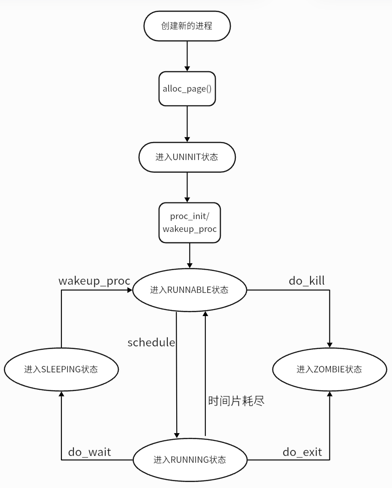

# Lab5 用户程序

---

安怡然 2213393 翟乐炜2213469 郭笑语 2211392

# 1. 实验目的

- 了解第一个用户进程创建过程
- 了解系统调用框架的实现机制
- 了解 ucore 如何实现系统调用 sys_fork/sys_exec/sys_exit/sys_wait 来进行进程管理

# 2. 实验内容

实验 4 完成了内核线程，但到目前为止，所有的运行都在内核态执行。实验 5 将创建用户进程，让用户进程在用户态执行，且在需要 ucore 支持时，可通过系统调用来让 ucore 提供服务。为此需要构造出第一个用户进程，并通过系统调用 ‘sys_fork‘/ *sys_exec* /*sys_exit* /*sys_wait* 来支持运行不同的应用程序，完成对用户进程的执行过程的基本管理。相关原理介绍可看附录 B。

### 练习0：填写已有实验

> 本实验依赖实验 1/2/3/4。请把你做的实验 1/2/3/4 的代码填入本实验中代码中有“LAB1”/“LAB2”/“LAB3”/“LAB4”的注释相应部分。注意：为了能够正确执行 lab5 的测试应用程序，可能需对已完成的实验 1/2/3/4
的代码进行进一步改进。
> 

在proc.c alloc_proc 函数中，新增两个初始化变量

```jsx
proc->wait_state = 0;  // 初始化进程等待状态
proc->cptr = proc->optr = proc->yptr = NULL;  // 初始化进程指针
```

表示当前进程没有子进程、父进程或兄弟进程

在 do_fork 函数中，我们相较于Lab 4做出如下修改：

1.在第一步创建进程时添加

ssert(current->wait_state == 0);  // 确保进程在等待

2.在第五步把原来的进程数++改为

```jsx
// list_add(&proc_list, &proc->list_link);
// nr_process++;  // 更新进程数
set_links(proc);  // 设置进程链接
```

### 练习1：**加载应用程序并执行（需要编码）**

> **do_execv** 函数调用 load_icode（位于 kern/process/proc.c 中）来加载并解析一个处于内存中的 ELF 执行文件格式的应用程序。你需要补充 load_icode 的第 6 步，建立相应的用户内存空间来放置应用程序的代码段、数据段等，且要设置好 proc_struct 结构中的成员变量 trapframe 中的内容，确保在执行此进程后，能够从应用程序设定的起始执行地址开始执行。需设置正确的 trapframe 内容。
> 
> 
> 请在实验报告中简要说明你的设计实现过程。
> 
> - 请简要描述这个用户态进程被 ucore 选择占用 CPU 执行（RUNNING 态）到具体执行应用程序第一条指令的整个经过。

```jsx
//(6) 为用户环境设置 trapframe
struct trapframe *tf = current->tf;
// Keep sstatus
uintptr_t sstatus = tf->status;
memset(tf, 0, sizeof(struct trapframe));
/* lab5:exercise1 你的代码
 * 应设置 tf->gpr.sp、tf->epc、tf->status
 * 注意：如果我们正确设置了 trapframe，那么用户级进程就可以从内核返回 USER MODE。所以tf->gpr.sp 应该是用户栈顶（sp 的值）
 * tf->epc 应该是用户程序的入口（sepc 的值）。
 * tf->status 应适合用户程序（sstatus 的值）
 * 提示：检查 SSTATUS 中 SPP、SPIE 的含义，通过 SSTATUS_SPP、SSTATUS_SPIE（定义在 risv.h 中）使用它们。
 */
// SSTATUS_SPP：Supervisor Previous Privilege（设置为 supervisor 模式）
// SSTATUS_SPIE：Supervisor Previous Interrupt Enable（设置为启用中断）
tf->gpr.sp = USTACKTOP;  // 设置f->gpr.sp为用户栈的顶部地址
tf->epc = elf->e_entry;  // 设置tf->epc为用户程序的入口地址
tf->status = (read_csr(sstatus) & ~SSTATUS_SPP & ~SSTATUS_SPIE);
  // 根据需要设置 tf->status 的值，清除 SSTATUS_SPP 和 SSTATUS_SPIE 位

ret = 0;
```

**第六步：设置 `trapframe`**

**`trapframe`** 是保存进程在发生上下文切换时的 CPU 状态（例如寄存器值、程序计数器、栈指针等）的数据结构。在用户程序启动时，需要通过设置 `trapframe` 来准备进入用户模式。

- **`sp`（栈指针）**：
    - 栈指针指向 `USTACKTOP`，即用户栈的顶部。
- **`epc`（程序计数器）**：
    - 程序计数器设置为 `elf->e_entry`，即 ELF 文件的入口地址。这是程序开始执行的位置，进程从这里开始执行用户代码。
- **`status`**：
    - `status` 控制进程的特权级别（用户模式或内核模式）和中断使能位。通过清除 `SSTATUS_SPP` 和 `SSTATUS_SPIE`，确保进程进入用户模式时启用中断，并设置合适的特权级别。

**用户态进程被 ucore 选择占用 CPU 执行（RUNNING 态）到具体执行应用程序第一条指令的整个经过。**

在init.c中调用proc_init(）初始化操作系统中的第一个内核线程idleproc（空闲进程）和第二个内核线程 init_main。

**`init_main`** 是第二个内核线程，它的作用是创建用户态进程并等待它们的退出。在 `init_main` 函数中，会调用 `user_main` 创建用户进程。

在static int user_main（void*arg）中，如果定义了 TEST，则会通过 KERNEL_EXECVE2执行名为TEST的用户程序，如果没有定义 TEST，则会执行 exit 程序，退出当前进程

```jsx
static int
user_main(void *arg) {
#ifdef TEST
KERNEL_EXECVE2(TEST, TESTSTART, TESTSIZE);
#else
KERNEL_EXECVE(exit);
#endif
panic("user_main execve failed.\n");
}
```

第一个用户进程是由第二个内核线程 initproc 通过把 hello 应用程序执行码覆盖到 initproc 的用户虚拟内存空间来创建的。

这个函数在缺省情况下是执行宏 KERNEL_EXECVE(hello)，而这个宏最终是调用 kernel_execve 函数来调用
SYS_exec 系统调用，由于 ld 在链接 hello 应用程序执行码时定义了两全局变量：
• _binary_obj___user_hello_out_start：hello 执行码的起始位置
• _binary_obj___user_hello_out_size 中：hello 执行码的大小
kernel_execve 把这两个变量作为 SYS_exec 系统调用的参数，让 ucore 来创建此用户进程。当 ucore 收到此系统调用后，将依次调用如下函数

```jsx
vector128(vectors.S)--\>
\_\_alltraps(trapentry.S)--\>trap(trap.c)--\>trap\_dispatch(trap.c)--
--\>syscall(syscall.c)--\>sys\_exec（syscall.c）--\>do\_execve(proc.c)
```

- do_execve函数来完成用户进程的创建工作，将用户态程序加载到内核态。此函数的主要工作流程如下：
    
    首先为加载新的执行码做好用户态内存空间清空准备。如果mm不为NULL，则设置页表为内核空间页表，且进一步判断mm的引用计数减1后是否为0，如果为0，则表明没有进程再需要此进程所占用的内存空间，为此将根据mm中的记录，释放进程所占用户空间内存和进程页表本身所占空间。最后把当前进程的mm内存管理指针为空。由于此处的initproc是内核线程，所以mm为NULL，整个处理都不会做。
    接下来的一步是加载应用程序执行码到当前进程的新创建的用户态虚拟空间中。这里涉及到读ELF格式的文件，申请内存空间，建立用户态虚存空间，加载应用程序执行码等。load_icode函数完成了整个复杂的工作。
    

- 在 load_icode 中，我们完成了对用户线程内存空间的初始化，堆栈的设置，并将 ELF 可执行文件进行了加载。随后，通过 current->tf 修改了当前的 trapframe ，使得中断返回的时候能够切换到用户态，并且可以正确地将控制权转移到应用程序的入口。
- kernel_thread 函数内调用了 do_fork 。 do_fork 内调用wake_proc 完成进程创建，并让进程处于就绪状态（RUNNABLE），等待调度执行。
- initproc 在创建用户进程后调用 do_wait 函数，等待就绪状态（RUNNABLE）的子进程出现进行
调度，调用 schedule 函数。
- schedule 函数被激活后调用 proc_run 函数运行新的进程
    
    将 satp 寄存器设置为用户态进程的页表基址（ lcr3(to->cr3) ）
    调用 swtich_to 函数进行上下文切换，保存当前寄存器状态，恢复待执行进程的寄存器状态
    使用 ret 指令跳转到 ra 寄存器指向的地址处继续执行（事实上，在 do_fork 函数内，我们调用了 copy_thread 函数，将该寄存器指向了 forkret 。因此我们在切换上下文之后，会跳转到 forkret 函数中）
    
- forkret 函数会调用 forkrets ( trapentry.S )，从这里跳转到 __trapret ，转而保存所有的寄
存器，即调用宏 RESTORE_ALL 。此时由于我们已经在在 load_icode 将 SSTATUS_SPP 设置为
0，因此不执行跳转，保存内核态栈指针，恢复 sstatus 和 sepc 以及通用寄存器，然后执行
sret 指令回到用户态。
- 跳转到 sepc 指向的地址处，即 ELF 文件的入口地址，从而执行用户态程序

### 练习2：**父进程复制自己的内存空间给子进程（需要编码）**

> 创建子进程的函数 do_fork 在执行中将拷贝当前进程（即父进程）的用户内存地址空间中的合法内容到新进程中（子进程），完成内存资源的复制。具体是通过 copy_range 函数（位于 kern/mm/pmm.c 中）实现的，请补充 copy_range 的实现，确保能够正确执行。
> 
> - 如何设计实现 Copy on Write 机制？给出概要设计，鼓励给出详细设计
> 
> Copy-on-write（简称 COW）的基本概念是指如果有多个使用者对一个资源 A（比如内存块）进行读操作，则每个使用者只需获得一个指向同一个资源 A 的指针，就可以该资源了。若某使用者需要对这个资源 A 进行写操作，系统会对该资源进行拷贝操作，从而使得该“写操作”使用者获得一个该资源 A 的“私有”拷贝—资源 B，可对资源 B 进行写操作。该“写操作”使用者对资源 B的改变对于其他的使用者而言是不可见的，因为其他使用者看到的还是资源 A。
> 

**补充 copy_range**

void *kva_src = page2kva(page)：获取父进程的内存页对应的内核虚拟地址。

void *kva_dst = page2kva(npage)：获取子进程的内存页对应的内核虚拟地址。

memcpy(kva_dst, kva_src, PGSIZE)：将父进程的内存页内容复制到子进程的内存页。

ret = page_insert(to, npage, start, perm): 将子进程的内存页插入到子进程的页表中

 **设计实现 Copy on Write 机制**

 **1. 基本原理**
**Copy on Write（COW，写时复制）** 是一种用于优化内存管理的机制。其核心思想是
**多个进程共享同一块内存数据，只有当某个进程试图修改数据时，才为该进程分配一份私有的内存副本**。  

这种方式可以避免不必要的内存拷贝，提高内存利用率，适用于进程间共享内存、虚拟内存管理等场景。

---

 **2. 设计思路**

 **2.1 初始共享阶段**
- 当父进程通过 `fork()` 创建子进程时，父进程与子进程共享同一块物理内存页。
- 将共享的内存页标记为 **只读**，禁止直接修改。
- 页表项中设置一个 **COW 标志**，用于标记该页支持写时复制。

 **2.2 写操作触发机制**
- 当某个进程尝试写入共享的只读内存页时，会触发 **页错误（Page Fault）**。
- 操作系统捕获到页错误后，检查该页的 **COW 标志**。

 **2.3 处理页错误**
- 如果页错误是由写时复制引起的，操作系统会执行以下操作：
  1. **分配新的物理内存页**：为需要修改数据的进程分配一块新的内存空间。
  2. **数据拷贝**：将原始内存页的数据拷贝到新分配的内存页中。
  3. **更新页表**：将进程的页表项指向新分配的内存页，并将其标记为 **可写**。
  4. **恢复执行**：完成写时复制操作后，进程可以继续执行修改操作。

 **2.4 其他进程的影响**
- 其他共享该内存页的进程仍然指向原始的只读内存页，直到它们需要修改时才会触发自己的写时复制。


### 练习3：**阅读分析源代码，理解进程执行 fork/exec/wait/exit 的实现，以及系统调用的实现（不需要编码）**

> 请在实验报告中简要说明你对 fork/exec/wait/exit 函数的分析。并回答如下问题：
• 请分析 fork/exec/wait/exit 的执行流程。重点关注哪些操作是在用户态完成，哪些是在内核态完成？内核态与用户态程序是如何交错执行的？内核态执行结果是如何返回给用户程序的？
• 请给出 ucore 中一个用户态进程的执行状态生命周期图（包执行状态，执行状态之间的变换关系，以及产生变换的事件或函数调用）。（字符方式画即可）
执行：make grade。如果所显示的应用程序检测都输出 ok，则基本正确。（使用的是 qemu-1.0.1）
> 

**分析fork/exec/wait/exit的执行流程**

| **系统调用名** | **含义**                               | **具体完成服务的函数**                                       |
| -------------- | -------------------------------------- | ------------------------------------------------------------ |
| SYS_exit       | process exit                           | do_exit                                                      |
| SYS_fork       | create child process, dup mm           | do_fork->wakeup_proc                                         |
| SYS_wait       | wait process                           | do_wait                                                      |
| SYS_exec       | after fork, process execute a program  | load a program and refresh the mm                            |
| SYS_clone      | create child thread                    | do_fork->wakeup_proc                                         |
| SYS_yield      | process flag itself need resecheduling | proc->need_sched=1, then scheduler will rescheule this process |
| SYS_sleep      | process sleep                          | do_sleep                                                     |
| SYS_kill       | kill process                           | do_kill->proc->flags \|= PF_EXITING->wakeup_proc->do_wait->do_exit |
| SYS_getpid     | get the process's pid                  |                                                              |

一般来说，用户进程只能执行一般的指令，无法执行特权指令。采用**系统调用**机制为用户进程提供一个获得操作系统服务的统一接口层，简化用户进程的实现。

应用程序调用的exit/fork/wait/exec等库函数最终都会调用syscall函数，只是调用的参数不同而已。

##### fork调用过程

**用户态**：fork() -> sys_fork() -> do_fork() -> syscall(SYS_fork) -> ecall

**内核态**：syscall() -> sys_fork() ->do_fork(0, stack, tf)

首先当程序执行fork时，fork使用了系统调用SYS_fork，而系统调用SYS_fork则主要是由do_fork和`wakeup_proc`来完成的。其中，`do_fork`主要完成了以下工作：

1. 首先检查当前总进程数目是否到达限制，分配并初始化进程控制块（ `alloc_proc` 函数）;
2. 分配并初始化内核栈（ `setup_stack` 函数）;
3. 根据 clone_flag 标志复制或共享进程内存管理结构（ `copy_mm` 函数）;
4. 设置进程在内核（将来也包括用户态）正常运行和调度所需的中断帧和执行上下文 （ `copy_thread` 函数）;
5. 为进程分配一个 PID（ `get_pid` 函数）;
6. 把设置好的进程控制块放入 `hash_list `和 `proc_list` 两个全局进程链表中;
7. 自此，进程已经准备好执行了，把进程状态设置为“就绪”态;
8. 设置返回码为子进程的 PID 号。

##### exec调用过程

**内核态**：kernel_execve() -> ebreak -> syscall() -> sys_exec() -> do_execve()

当应用程序执行的时候，会调用 SYS_exec 系统调用，而当 ucore 收到此系统调用的时候，则会使用 do_execve() 函数来实现，因此这里我们主要介绍 `do_execve() `函数的功能，函数完成用户进程的创建工作，同时使用户进程进入执行。

主要工作如下：

1、检查进程名称的地址和长度是否合法，合法则将名称暂存在函数栈中；

2、将cr3页表基址指向内核页表，然后实现对进程的内存管理区域的释放；

3、调用load_icode将代码加载进内存并建立新的内存映射关系，如果加载错误，那么调用panic报错；

4、调用set_proc_name重新设置进程名称。

##### wait调用过程

prco_init()` ->`kernel_thread()` -> `init_main()` -> `do_wait()

当执行 wait 功能的时候，会调用系统调用 SYS_wait，而该系统调用的功能则主要由 do_wait 函数实现，主要工作就是父进程如何完成对子进程的最后回收工作，具体的功能实现如下：

1、如果 pid!=0，表示只找一个进程 id 号为 pid 的退出状态的子进程，否则找任意一个处于退出状态的子进程;

2、 如果此子进程的执行状态不为 `PROC_ZOMBIE`，表明此子进程还没有退出，则当前进程设置执行状态为 `PROC_SLEEPING`，睡眠原因为 `WT_CHILD` (即等待子进程退出)，调用 schedule() 函数选择新的进程执行，自己睡眠等待，如果被唤醒，则重复跳回步骤1处执行;

3、 如果此子进程的执行状态为 PROC_ZOMBIE，表明此子进程处于退出状态，需要当前进程(即子进程的父进程)完成对子进程的最终回收工作，即首先把子进程控制块从两个进程队列 proc_list 和 hash_list 中删除，并释放子进程的内核堆栈和进程控制块。自此，子进程才彻底地结束了它的执行过程，它所占用的所有资源均已释放。

##### exit调用过程

**内核态**： `kernel_execve()`-> `ebreak` -> `syscall()` -> `sys_exec()` -> `do_execve()` ->`execve_exit` ->`do_exit`

prco_init()` ->`kernel_thread()` -> `init_main()` -> `do_wait()` -> `do_exit

1、检查当前进程是否是idleproc或initproc，若是则`panic`；

2、获取内存管理结构，减少对内存管理结构的引用计数，如果引用计数降为零，代表没有其他进程共享该内存管理结构，那么清理映射并释放页目录表，最后销毁内存管理结构；

3、最后，将当前进程的 `mm` 指针设置为 `NULL`。将进程的状态设置为 `PROC_ZOMBIE`，表示进程已经退出；

4、如果父进程处于等待当前进程退出的状态，则将父进程唤醒。

5、如果当前进程有子进程，则将子进程设置为initproc的子进程，并完成子进程中处于僵尸状态的进程的最后的回收工作。最后，进行调度，选择新的进程执行。


**fork/exec/wait/exit 在实现中是影响进程的执行状态的方式如下：**

- fork 执行完毕后，如果创建新进程成功，则出现两个进程，一个是子进程，一个是父进程。在子进程中，fork 函数返回 0，在父进程中，fork 返回新创建子进程的进程 ID。我们可以通过 fork 返回的值来判断当前进程是子进程还是父进程。fork 不会影响当前进程的执行状态，但是会将子进程的状态标记为 RUNNABLE，使得可以在后续的调度中运行起来；
- exec 完成用户进程的创建工作。首先为加载新的执行码做好用户态内存空间清空准备。接下来的一步是加载应用程序执行码到当前进程的新创建的用户态虚拟空间中。exec 不会影响当前进程的执行状态，但是会修改当前进程中执行的程序；
- wait 是等待任意子进程的结束通知。wait_pid 函数等待进程 id 号为 pid 的子进程结束通知。这两个函数最终访问 sys_wait 系统调用接口让 ucore 来完成对子进程的最后回收工作。wait 系统调用取决于是否存在可以释放资源（ZOMBIE）的子进程，如果有的话不会发生状态的改变，如果没有的话会将当前进程置为 SLEEPING 态，等待执行了 exit 的子进程将其唤醒；
- exit 会把一个退出码 error_code 传递给 ucore，ucore 通过执行内核函数 do_exit 来完成对当前进程的退出处理，主要工作简单地说就是回收当前进程所占的大部分内存资源，并通知父进程完成最后的回收工作。exit 会将当前进程的状态修改为 ZOMBIE 态，并且会将父进程唤醒（修改为RUNNABLE），然后主动让出 CPU 使用权。

**给出ucore中一个用户态进程的执行状态生命周期图**




### 扩展练习 Challenge：

> 
> 
> 1. 实现 Copy on Write （COW）机制
> 给出实现源码, 测试用例和设计报告（包括在 cow 情况下的各种状态转换（类似有限状态自动机）的说明）。
> 这个扩展练习涉及到本实验和上一个实验“虚拟内存管理”。在 ucore 操作系统中，当一个用户父进程创建自己的子进程时，父进程会把其申请的用户空间设置为只读，子进程可共享父进程占用的用户内存空间中的页面（这就是一个共享的资源）。当其中任何一个进程修改此用户内存空间中的某页面时，ucore 会通过 page fault 异常获知该操作，并完成拷贝内存页面，使得两个进程都有各自的内存页面。这样一个进程所做的修改不会被另外一个进程可见了。请在 ucore 中实现这样的 COW 机制。
> 由于 COW 实现比较复杂，容易引入 bug，请参考 [https://dirtycow.ninja/](https://dirtycow.ninja/) 看看能否在 ucore 的 COW 实现中模拟这个错误和解决方案。需要有解释。
> 这是一个 big challenge.
> 2. 说明该用户程序是何时被预先加载到内存中的？与我们常用操作系统的加载有何区别，原因是什么？

在项目编译的时候载入内存的。在宏定义KERNEL_EXECVE我们可以发现用户态的程序载入其实是通过特定的编译输出文件，此次实验更改了Makefile，并且通过ld指令将用户态程序（user文件夹下的代码）编译链接到项目中。所以在ucore启动的时候用户程序就被加载在内存中了。

与常用操作系统的加载有所不同，常用操作系统通常采用**按需加载**的方式，即在程序执行时，根据需要将程序从磁盘或其他存储介质中加载到内存中，然后执行。这是因为常用操作系统需要支持多任务和动态加载程序的特性，因此用户程序可能是在运行时才被加载到内存中的。这种加载方式具有灵活性，可以在运行时根据需要加载不同的程序，节省内存空间。

而在ucore实验中，由于ucore是一个简化的操作系统，没有实现动态加载的功能。实验中的用户程序都比较简单，加载到内存中的用户程序数量有限。因此，在实验中用户程序是在ucore启动时就**被预先加载到内存**中，一起进行初始化和启动。免了在运行时多次从磁盘加载用户程序的开销。 这样可以简化设计和实现，并且保持实验的简洁性。